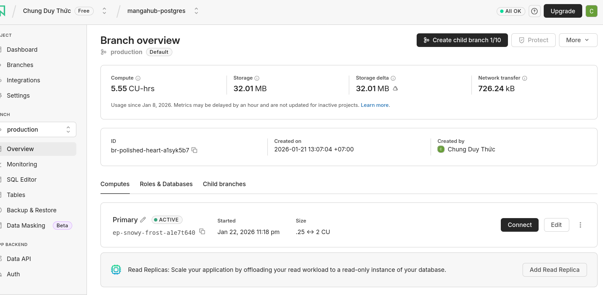
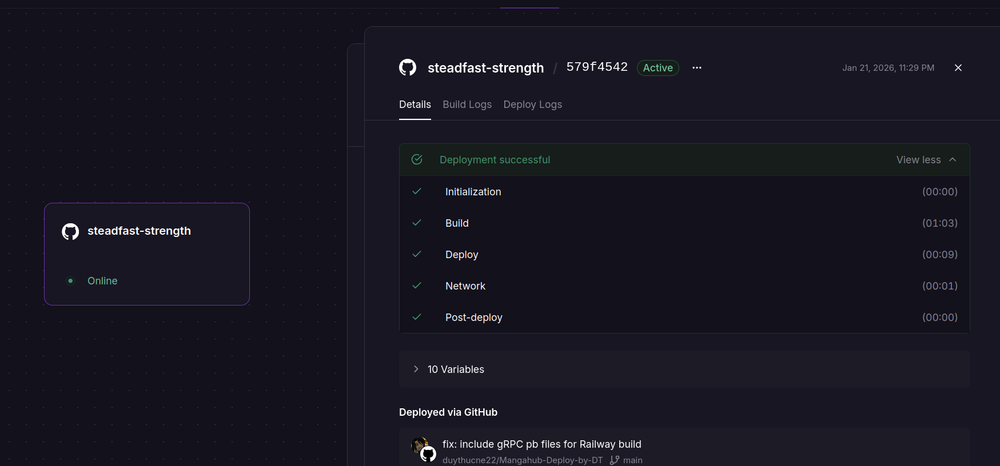

<div align="center">

# 🎌 MangaHub

### Your Ultimate Manga Discovery & Community Platform

[](https://go.dev/)
[](https://www.postgresql.org/)
[](https://redis.io/)
[](https://grpc.io/)
[](LICENSE)

**A blazingly fast, multi-protocol manga platform** featuring real-time chat, advanced search, statistics tracking, and a beautiful TUI client. Built with modern Go practices and deployed on Railway with zero downtime.

[🚀 Live Demo](https://your-railway-url.railway.app) • [📚 Documentation](#documentation) • [🐛 Report Bug](https://github.com/yourusername/mangahub/issues) • [✨ Request Feature](https://github.com/yourusername/mangahub/issues)

</div>

---

## ✨ Features

### 🎯 Core Capabilities
- **🔍 Advanced Search**: Multi-source manga aggregation from MAL, MangaDex, and more
- **💬 Real-time Chat**: WebSocket-powered live discussions with chat rooms
- **📊 Statistics Dashboard**: Track reading habits, popular manga, and trending series
- **🎨 Beautiful TUI**: Terminal-based interface built with Bubble Tea
- **🔐 Secure Authentication**: JWT-based auth with bcrypt password hashing
- **⚡ Multi-Protocol Support**: HTTP/REST, gRPC, WebSocket, TCP, and UDP

### 🏗️ Architecture Highlights
- **Microservices-Ready**: Clean separation of concerns with domain-driven design
- **High Performance**: Redis caching, connection pooling, and optimized queries
- **Real-time Events**: Activity feed with live updates via WebSocket
- **External API Integration**: Seamless integration with Jikan (MAL) and MangaDex APIs
- **Comprehensive Testing**: Unit tests with `testify` framework
- **Production-Ready**: Docker support, graceful shutdowns, health checks

---

## 🚀 Quick Start

### Prerequisites
- **Go** 1.25.1 or higher
- **PostgreSQL** 15+
- **Redis** (for caching)
- **Git**

### Installation

```bash
# Clone the repository
git clone https://github.com/yourusername/mangahub.git
cd mangahub

# Install dependencies
go mod download

# Set up the database
psql -U postgres -f deployments/schema.sql
psql -U postgres -f seed.sql  # Optional: Add sample data

# Configure environment
cp configs/development.yaml.example configs/development.yaml
# Edit configs/development.yaml with your settings

# Build the server
make build

# Run the server
./bin/server

# Or run the TUI client
./bin/tui
```

The server will start on `http://localhost:8080` by default.

---

## 🌐 API Protocols

MangaHub supports multiple communication protocols for different use cases:

| Protocol | Port | Use Case |
|----------|------|----------|
| **HTTP/REST** | 8080 | Main API, CRUD operations |
| **gRPC** | 50051 | High-performance service-to-service |
| **WebSocket** | 8081 | Real-time chat and notifications |
| **TCP** | 6000 | Custom stats aggregation |
| **UDP** | 4000 | Lightweight event broadcasting |

### Example API Calls

```bash
# Register a new user
curl -X POST http://localhost:8080/auth/register \
  -H "Content-Type: application/json" \
  -d '{"username": "manga_lover", "password": "SecurePass123!"}'

# Search for manga
curl http://localhost:8080/manga/search?q=naruto

# Get statistics
curl http://localhost:8080/stats/popular \
  -H "Authorization: Bearer YOUR_JWT_TOKEN"
```

For complete API documentation, see [UseCase.md](UseCase.md).

---

## 🎨 Terminal UI (TUI)

MangaHub includes a gorgeous terminal interface for those who prefer the command line:

```bash
# Start the TUI
./bin/tui

# Or with custom config
./bin/tui --config mangahub-tui.yaml
```

**Features:**
- 🔐 Login/Register flow
- 📚 Browse manga library
- 🔍 Advanced search
- 💬 Real-time chat rooms
- 📊 Statistics dashboard
- ⚡ Lightning-fast keyboard navigation

---

## 🐳 Docker Deployment

```bash
# Build and run with Docker Compose
docker-compose up -d

# View logs
docker-compose logs -f

# Stop services
docker-compose down
```

---

## ☁️ Railway Deployment

MangaHub is designed for seamless deployment on Railway with Neon PostgreSQL.

### Deployment Steps

1. **Set Up Neon Database**
   - Create a new project at [neon.tech](https://neon.tech)
   - Copy your connection string
   - Run the schema: `deployments/schema.sql`
   
   

2. **Deploy to Railway**
   - Connect your GitHub repository to Railway
   - Add environment variables:
     ```
     DATABASE_URL=your_neon_connection_string
     JWT_SECRET=your_secret_key
     PORT=8080
     ```
   - Railway will automatically detect and build your Go app
   
   

3. **Verify Deployment**
   ```bash
   curl https://steadfast-strength-production.up.railway.app/health
   ```

For detailed deployment instructions, see [DEPLOYMENT.md](DEPLOYMENT.md).

### Environment Variables

| Variable | Description | Required |
|----------|-------------|----------|
| `DATABASE_URL` | PostgreSQL connection string | ✅ |
| `REDIS_URL` | Redis connection string | ✅ |
| `JWT_SECRET` | Secret key for JWT tokens | ✅ |
| `PORT` | Server port (default: 8080) | ⬜ |
| `LOG_LEVEL` | Logging level (debug/info/warn/error) | ⬜ |
| `JIKAN_API_URL` | MyAnimeList API endpoint | ⬜ |
| `MANGADEX_API_URL` | MangaDex API endpoint | ⬜ |

---

## 📁 Project Structure

```
mangahub/
├── cmd/                    # Application entry points
│   ├── server/            # Main HTTP/gRPC server
│   ├── tui/               # Terminal UI client
│   └── data-cli/          # Data management CLI
├── internal/              # Private application code
│   ├── core/              # Business logic layer
│   ├── protocols/         # Protocol implementations
│   │   ├── http/          # REST API handlers
│   │   ├── grpc/          # gRPC services
│   │   ├── websocket/     # Real-time chat
│   │   ├── tcp/           # TCP server
│   │   └── udp/           # UDP server
│   ├── repository/        # Data access layer
│   └── tui/               # TUI components
├── pkg/                   # Public reusable packages
│   ├── config/            # Configuration management
│   ├── database/          # Database connections
│   ├── models/            # Domain models
│   ├── cache/             # Redis caching
│   ├── logger/            # Structured logging
│   ├── external/          # External API clients
│   └── utils/             # Utility functions
├── deployments/           # Database schemas
├── configs/               # Configuration files
├── proto/                 # Protocol buffer definitions
└── test/                  # Integration tests
```

---

## 🧪 Testing

```bash
# Run all tests
make test

# Run with coverage
go test -cover ./...

# Run specific test file
go test ./pkg/database/postgres_test.go

# Use the test scripts
./scripts/test_api.sh
./scripts/simple_test.sh
```

See [docs/TESTING.md](docs/TESTING.md) for comprehensive testing guide.

---

## 🔧 Development

### Building

```bash
# Build server
make server

# Build TUI
make tui

# Build all
make build

# Clean build artifacts
make clean
```

### Makefile Commands

```bash
make help          # Show all available commands
make run           # Run server in development mode
make test          # Run tests
make lint          # Run linter
make proto         # Generate protobuf code
make migrate       # Run database migrations
```

---

## 📊 Monitoring & Observability

MangaHub includes built-in observability features:

- **Structured Logging**: JSON-formatted logs with contextual information
- **Health Checks**: `/health` and `/ready` endpoints
- **Metrics**: Prometheus-compatible metrics (in progress)
- **Tracing**: Distributed tracing support (planned)

---

## 🤝 Contributing

We welcome contributions! Here's how you can help:

1. **Fork the repository**
2. **Create a feature branch** (`git checkout -b feature/amazing-feature`)
3. **Commit your changes** (`git commit -m 'Add some amazing feature'`)
4. **Push to the branch** (`git push origin feature/amazing-feature`)
5. **Open a Pull Request**

### Contribution Guidelines

- Write clear, descriptive commit messages
- Add tests for new features
- Update documentation as needed
- Follow Go best practices and idioms
- Run `go fmt` and `go vet` before committing

---

## 📚 Documentation

- **[DEPLOYMENT.md](DEPLOYMENT.md)** - Complete deployment guide for Railway + Neon
- **[UseCase.md](UseCase.md)** - API endpoints and manual testing guide
- **[config.md](config.md)** - Configuration specification and environment variables
- **[docs/TESTING.md](docs/TESTING.md)** - Testing strategies and examples

---

## 🛣️ Roadmap

### Version 1.0 (Current)
- ✅ Multi-protocol server architecture
- ✅ JWT authentication
- ✅ Real-time WebSocket chat
- ✅ Terminal UI client
- ✅ External API integration (MAL, MangaDex)
- ✅ Railway deployment support

### Version 1.1 (Next)
- 🔄 User profiles and avatars
- 🔄 Manga recommendations engine
- 🔄 Reading lists and favorites
- 🔄 Email notifications
- 🔄 Admin dashboard
- 🔄 Rate limiting and API throttling

### Version 2.0 (Future)
- 📋 Mobile app (React Native)
- 📋 GraphQL API
- 📋 ElasticSearch integration
- 📋 Content delivery network (CDN)
- 📋 Internationalization (i18n)
- 📋 OAuth2 providers (Google, GitHub)

---

## 📄 License

This project is licensed under the **MIT License** - see the [LICENSE](LICENSE) file for details.

```
MIT License

Copyright (c) 2026 MangaHub Contributors

Permission is hereby granted, free of charge, to any person obtaining a copy
of this software and associated documentation files (the "Software"), to deal
in the Software without restriction, including without limitation the rights
to use, copy, modify, merge, publish, distribute, sublicense, and/or sell
copies of the Software, and to permit persons to whom the Software is
furnished to do so, subject to the following conditions:

The above copyright notice and this permission notice shall be included in all
copies or substantial portions of the Software.

THE SOFTWARE IS PROVIDED "AS IS", WITHOUT WARRANTY OF ANY KIND, EXPRESS OR
IMPLIED, INCLUDING BUT NOT LIMITED TO THE WARRANTIES OF MERCHANTABILITY,
FITNESS FOR A PARTICULAR PURPOSE AND NONINFRINGEMENT. IN NO EVENT SHALL THE
AUTHORS OR COPYRIGHT HOLDERS BE LIABLE FOR ANY CLAIM, DAMAGES OR OTHER
LIABILITY, WHETHER IN AN ACTION OF CONTRACT, TORT OR OTHERWISE, ARISING FROM,
OUT OF OR IN CONNECTION WITH THE SOFTWARE OR THE USE OR OTHER DEALINGS IN THE
SOFTWARE.
```

---

## 🙏 Acknowledgments

- **[Bubble Tea](https://github.com/charmbracelet/bubbletea)** - Delightful TUI framework
- **[Gin](https://github.com/gin-gonic/gin)** - HTTP web framework
- **[gRPC](https://grpc.io/)** - High-performance RPC framework
- **[PostgreSQL](https://www.postgresql.org/)** - Robust relational database
- **[Redis](https://redis.io/)** - Lightning-fast caching
- **[Jikan API](https://jikan.moe/)** - Unofficial MyAnimeList API
- **[MangaDex API](https://api.mangadex.org/)** - Manga metadata and images

---

## 📞 Support & Contact

- **Issues**: [GitHub Issues](https://github.com/yourusername/mangahub/issues)
- **Discussions**: [GitHub Discussions](https://github.com/yourusername/mangahub/discussions)
- **Email**: support@mangahub.dev (if applicable)
- **Discord**: [Join our community](https://discord.gg/mangahub) (if applicable)

---

## ⭐ Star History

If you find this project useful, please consider giving it a star! ⭐

[](https://star-history.com/#yourusername/mangahub&Date)

---

## 💖 Support the Project

If you'd like to support the development of MangaHub:

- ⭐ Star the repository
- 🐛 Report bugs and issues
- 💡 Suggest new features
- 🤝 Contribute code
- 📢 Share with the community

---

<div align="center">

**Made with ❤️ by manga enthusiasts, for manga enthusiasts**

[⬆ Back to Top](#-mangahub)

</div>
