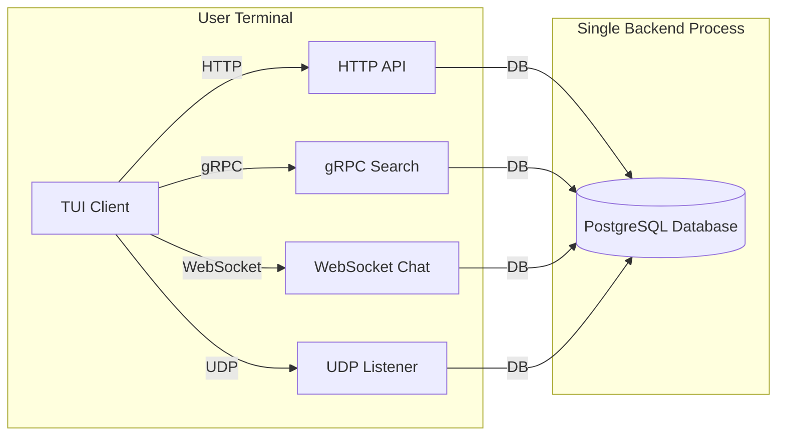

# Manga Discord-Like Forum — Architecture Specification

## 1. Overview

This system is a **Discord-like, terminal-first manga community forum centered around manga**, designed with:

The application focuses on:
- Searching and browsing manga
- Manga-scoped real-time chat
- Commenting and liking comments
- Activity feeds and notifications
- Statstics / hot manga based on activity

### Key Constraints
- **Resource-limited deployment** (Railway/Render free tiers)
- **No web frontend** – only terminal interface (TUI)
- **Single backend process** with multiple protocol implementations
- Must teach practical protocol usage (HTTP, gRPC, WebSocket, UDP, TCP)
---

## 2. High-Level Architecture

### Key Components
| Component | Protocol | Purpose | Learning Value |
|----------|----------|---------|----------------|
| **API Service** | HTTP/REST | User auth, manga data, comments | Standard request-response patterns |
| **Search Service** | gRPC | Manga stream search with FTS | Binary protocols, streaming RPC |
| **Chat Service** | WebSocket | Real-time per-manga discussions | Bidirectional communication |
| **Notification Bus** | UDP | Broadcast chapter updates | Connectionless messaging |
| **Stats Service** | TCP (internal) | Aggregate activity metrics | Custom protocol design |
| **TUI Client** | N/A | User interface | Terminal UI patterns |

### Deployment Reality
- **Single Go binary** serving 5 protocols
- **One PostgreSQL instance** (no sharding)
- **One Railway deployment unit** (no microservices)
- **TUI client** distributed as static binary

---

## 3. Database Strategy

- **Monolith database**
- Services **do not own tables**, but:
  - Only *write* to tables they are responsible for
  - Other services read via APIs, not direct DB access
- Database acts as:
  - Source of truth
  - Persistence layer
  - Audit / history log

### Schema Implementation
- Directly uses `schema.sql` from specification
- No modifications needed for monolith architecture
- **Critical tables**:
  - `manga_stats` (atomic counters for rankings)
  - `manga_fts` (full-text search index)
  - `chat_messages` (real-time message storage)

### Connection Management
- **Single database connection pool** shared across all protocols
- Max connections: 25 per instance (adjustable via config)
- All transactions use PostgreSQL's ACID guarantees

---

## 4. Service Responsibilities (Internal Models)

| Module | Protocol | Key Responsibilities | Failure Impact |
|--------|----------|----------------------|----------------|
| **HTTP API** | HTTP/REST | - User authentication - Manga data access - Comment management | Users cannot log in or view content |
| **gRPC Search** | gRPC | - Full-text search - Search result streaming - Index maintenance | Search functionality degraded |
| **WebSocket Chat** | WebSocket | - Real-time message broadcast - User presence tracking - Chat history | Real-time discussion disabled |
| **UDP Notifier** | UDP | - Notification broadcasting - Rate limiting - Packet validation | Users miss chapter updates |
| **TCP Stats** | TCP (internal) | - Activity aggregation - Weekly score calculation - Counter persistence | Rankings become stale |

> **Note**: These are **internal modules**, not separate services. All run within a single Go process with shared database access.

### 4.1 Auth & Core API Service (HTTP)

**Protocol:** HTTP/REST  
**Responsibilities:**
- User authentication
- Role enforcement (user / moderator / admin)
- Manga CRUD (admin only)
- Comment CRUD
- Like comment (increment)
- Fetch manga detail pages

**Tables touched:**
- `users`
- `manga`
- `comments`
- `activity_feed`

---

### 4.2 Search Service (gRPC)

**Protocol:** gRPC  
**Responsibilities:**
- Keyword search
- Full-text search on manga title & description
- Auto-suggest / prefix search

**Data source:**
- `manga_fts`

**Why gRPC:**
- Fast binary protocol
- Low latency
- Typed contracts
- Suitable for high-QPS search queries

---

### 4.3 Chat Service (WebSocket)

**Protocol:** WebSocket  
**Responsibilities:**
- Real-time chat per manga
- Each manga = one implicit channel
- Broadcast messages to connected clients
- Persist chat history

**Tables touched:**
- `chat_messages`
- `activity_feed`

**Notes:**
- No explicit chat rooms table
- Authorization via HTTP token before WS upgrade

---

### 4.4 Notification / Broadcast Service (UDP)

**Protocol:** UDP  
**Responsibilities:**
- Fire-and-forget broadcast notifications
- No guarantee of delivery
- Online clients only

**Use cases:**
- Admin adds new manga
- Admin adds new chapter
- System announcements

**Tables touched:**
- `notifications` (optional log)
- `activity_feed`

**Rationale:**
- No retry
- No connection overhead
- Extremely low latency
- Fits ephemeral notifications

---

### 4.5 Stats & Ranking Service (TCP)

**Protocol:** TCP (custom lightweight protocol)  
**Responsibilities:**
- Aggregate activity counts
- Compute scores for:
  - Hot manga (weekly)
  - Trending manga (real-time)
- Maintain rolling counters

**Consumes events from:**
- Comment creation
- Comment like
- Chat message

**Produces:**
- Ranked manga lists (via HTTP or gRPC)

**Tables touched:**
- `manga_stats`

**Why TCP:**
- Persistent connections
- Low overhead vs HTTP
- Simple event streaming
- Internal service only (never client-facing)

---

## 5. Activity Flow

### 5.1 Comment Created

1. Client → HTTP → Comment Service
2. Insert into `comments`
3. Insert into `activity_feed`
4. Emit event → TCP → Stats Service
5. Stats Service increments counters

---

### 5.2 Chat Message

1. Client → WebSocket → Chat Service
2. Broadcast to channel
3. Persist to `chat_messages`
4. Insert into `activity_feed`
5. Emit event → TCP → Stats Service

---

### 5.3 Admin Manga Update

1. Admin → HTTP → Manga Service
2. Insert / update `manga`
3. Insert into `activity_feed`
4. Broadcast via UDP
5. Online clients receive immediately

---

## 6. Role Model

| Role | Capabilities | Protocol Access |
|------|--------------|-----------------|
| **Reader** | - View manga - Read comments - Join chats | HTTP, WebSocket |
| **Moderator** | - Delete comments - Ban users - Manage genres | HTTP (admin endpoints) |
| **Admin** | - Database backups - Service monitoring | HTTP (internal endpoints) |
| **TUI Client** | - All user interactions | All protocols |

> **Note**: No role requires web access – all management happens via terminal pannel and key binding ctrl + ... 

Role enforcement happens **at HTTP and WebSocket handshake level**.

---

## 7. Non-Goals (Intentional)

- No per-chapter reading progress
- No manga ratings (1–10)
- No achievement system
- No heavy analytics pipeline
- No distributed database

These can be added later without breaking the architecture.

---

## 8. Design Principles

- **Right protocol for the job**
- **Simple data model**
- **Activity-driven ranking**
- **Loose coupling, shared persistence**
- **Realtime first**
### 1. Protocol Diversity within Monolith
> *"Implement multiple protocols in a single process to learn their characteristics without distributed systems complexity."*

- HTTP for standard REST operations
- gRPC for efficient search
- WebSocket for bidirectional chat
- UDP for fire-and-forget notifications
- TCP for internal stats (no client exposure)

### 2. Terminal-First UX
> *"The terminal is not a limitation – it's the primary interface by design."*

- Zero browser dependencies
- Works on any SSH-capable device
- Minimal resource footprint (<100MB RAM)
- Keyboard-driven navigation

### 3. Resource Efficiency
> *"Deploy anywhere with free-tier constraints."*

- Single binary = single deployment unit
- One database connection pool
- No service discovery overhead
- Configurable resource limits

### 4. Progressive Learning Path
> *"Each protocol serves a specific leverage purpose."*

| Protocol | Learning Objective | Real-World Analogy |
|----------|-------------------|-------------------|
| HTTP | Standard API patterns | Web browsers |
| gRPC | Binary efficiency | Internal microservices |
| WebSocket | Persistent connections | Slack/Chat apps |
| UDP | Connectionless messaging | DNS/DHCP |
| TCP | Custom protocol design | Database protocols |